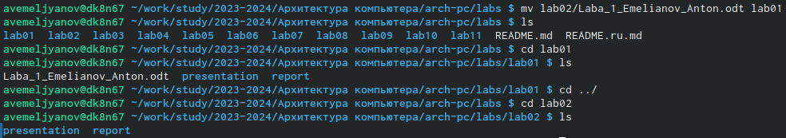

---
## Front matter
title: "Шаблон отчёта по лабораторной работе №2"
subtitle: "OK-норм вариант, исчерпывающий, 9/6 баллов, дальше вы хотите проверять."
author: "Емельянов Антон (НПМбв-01-21)"

## Generic otions
lang: ru-RU
toc-title: "Содержание"

## Bibliography
bibliography: bib/cite.bib
csl: pandoc/csl/gost-r-7-0-5-2008-numeric.csl

## Pdf output format
toc: true # Table of contents
toc-depth: 2
lof: true # List of figures
lot: true # List of tables
fontsize: 12pt
linestretch: 1.5
papersize: a4
documentclass: scrreprt
## I18n polyglossia
polyglossia-lang:
  name: russian
  options:
	- spelling=modern
	- babelshorthands=true
polyglossia-otherlangs:
  name: english
## I18n babel
babel-lang: russian
babel-otherlangs: english
## Fonts
mainfont: PT Serif
romanfont: PT Serif
sansfont: PT Sans
monofont: PT Mono
mainfontoptions: Ligatures=TeX
romanfontoptions: Ligatures=TeX
sansfontoptions: Ligatures=TeX,Scale=MatchLowercase
monofontoptions: Scale=MatchLowercase,Scale=0.9
## Biblatex
biblatex: true
biblio-style: "gost-numeric"
biblatexoptions:
  - parentracker=true
  - backend=biber
  - hyperref=auto
  - language=auto
  - autolang=other*
  - citestyle=gost-numeric
## Pandoc-crossref LaTeX customization
figureTitle: "Рис."
tableTitle: "Таблица"
listingTitle: "Листинг"
lofTitle: "Список иллюстраций"
lotTitle: "Список таблиц"
lolTitle: "Листинги"
## Misc options
indent: true
header-includes:
  - \usepackage{indentfirst}
  - \usepackage{float} # keep figures where there are in the text
  - \floatplacement{figure}{H} # keep figures where there are in the text
---

# Цель работы

Целью работы является изучить идеологию и применение средств контроля версий. Приобрести практические навыки по работе с системой git. Дополнительной, но от этого не менее важной частью работы является повышение общей компьютерной грамотности пользователя, повышение скорости печати, уверенности в себе.

# Задание

Переписывать задания нет сил, я погибаю, так как это не приносит каких-то знаний и умений, предлагаю тренировать память - это крайне полезно для здоровья мозга, и как следствие продлит мою сознательную ментально здоровую жизнь в старости. А ещё можно тренировать терпимость (это если на этом моменте Вы чувствуете невыносимое желание закрыть работу и поставить 0 - этого делать НЕ надо, надо ставить 6).

# Теоретическое введение

Не столь уж и важно, ведь моя работа так исчерпывающе объясняет теорию данной лабораторной работы (методом пошагового обьяснения обрезанными, шакальными и не обязательно расставленными по порядку сериями случайных картинок), что никому даже в голову не придёт залезть в руководство ради такого сущего пустяка как подтверждение (проверка) информации, расширения области знания (зачем? Я ведь и так всё уже разложил по полочкам) или ещё какой чепухи (уважаемый автор данной работы, то есть Я, настоятельно не рекомендует делать лишних телодвижений: любите диван и он вас полюбит в ответ). На этом всё, будте здоровы.

# Выполнение лабораторной работы

Итак, приступим к описанию моих героических подвигов и гениальных изысканий совершённых в ходе выполнения этой работы:

Я всё выполнял строго по инструкции: Создал отчет по выполнению лабораторной работы в соответствующем каталоге рабочего пространства (labs>lab02>report).
Скопировал отчет по выполнению этой работы в соответствующие каталоги созданного рабочего пространства (рис. @fig:001), 

{#fig:001 width=80%}

создал репозиторий, начал проводить операции по связке компьютера и облачного хранилища (рис. @fig:002), 

{#fig:002 width=80%}

генерировал ключи, вбивал их (рис. @fig:003), 

{#fig:003 width=70%}

клонировал общий репозиторий курса на компьютер (рис. @fig:004), 

{#fig:004 width=70%}

после выгрузил на гит всё с компа (рис. @fig:005), 

{#fig:005 width=70%}

наконец крикнул git push и завершил работу (рис. @fig:006), а потом я копировал всё в директорию и загрузил отчёт на github, надеюсь всё на месте, также я всё это превратил в pdf.

{#fig:006 width=70%}

# Выводы

В ходе выполнения данной лабораторной работы мои навыки работы с операционной системой Linux и различными её системами (компонентами) несомненно улучшились по сравнению с моими навыками  до работы, также у меня открылось всевидящее око созерцания в середине лба: я стал остро чувствовать перемены окружающего мира не только в его физической составляющей, но и духовной - день ото дня я становлюсь всё ближе к своей просветлённой форме брахмана. А ещё я внёс свою скромную лепту в развитие компьютерных технологий, написав эту, несомненно уникальную и абсолютно недооценённую работу. Кроме того прошу Вас (дорогой читатель) обратить внимание на изящный и не обременяющий слог моего большого и богатого вывода, я определённо достоин премии по литературе за эту работу. Ах да, Гит и я = лучшие друзья, а ещё как-его-там Markdown.

# Список литературы{.unnumbered}

:::

