---
## Front matter
title: "Шаблон отчёта по лабораторной работе №6"
subtitle: "Приемлемый вариант, информативный, 6/6 баллов, дальше проверять."
author: "Емельянов Антон (НПМбв-01-21)"

## Generic otions
lang: ru-RU
toc-title: "Содержание"

## Bibliography
bibliography: bib/cite.bib
csl: pandoc/csl/gost-r-7-0-5-2008-numeric.csl

## Pdf output format
toc: true # Table of contents
toc-depth: 2
lof: true # List of figures
lot: true # List of tables
fontsize: 12pt
linestretch: 1.5
papersize: a4
documentclass: scrreprt
## I18n polyglossia
polyglossia-lang:
  name: russian
  options:
	- spelling=modern
	- babelshorthands=true
polyglossia-otherlangs:
  name: english
## I18n babel
babel-lang: russian
babel-otherlangs: english
## Fonts
mainfont: PT Serif
romanfont: PT Serif
sansfont: PT Sans
monofont: PT Mono
mainfontoptions: Ligatures=TeX
romanfontoptions: Ligatures=TeX
sansfontoptions: Ligatures=TeX,Scale=MatchLowercase
monofontoptions: Scale=MatchLowercase,Scale=0.9
## Biblatex
biblatex: true
biblio-style: "gost-numeric"
biblatexoptions:
  - parentracker=true
  - backend=biber
  - hyperref=auto
  - language=auto
  - autolang=other*
  - citestyle=gost-numeric
## Pandoc-crossref LaTeX customization
figureTitle: "Рис."
tableTitle: "Таблица"
listingTitle: "Листинг"
lofTitle: "Список иллюстраций"
lotTitle: "Список таблиц"
lolTitle: "Листинги"
## Misc options
indent: true
header-includes:
  - \usepackage{indentfirst}
  - \usepackage{float} # keep figures where there are in the text
  - \floatplacement{figure}{H} # keep figures where there are in the text
---

# Цель работы

ПОсвоение арифметических инструкций языка ассемблера NASM. Дополнительной, но от этого не менее важной частью работы является повышение общей компьютерной грамотности пользователя, повышение скорости печати, уверенности в себе.

# Задание

Переписывать задания не имеет смысла, так как это не приносит каких-то знаний и умений, предлагаю тренировать память - это крайне полезно для здоровья мозга, и как следствие возможно продлит мою возможно сознательную возможно ментально здоровую жизнь в старости. А ещё можно эффективно тренировать терпимость (это если на этом моменте Вы чувствуете невыносимое желание закрыть работу и поставить 0 - этого делать НЕ надо, надо ставить 6).

# Теоретическое введение

Опасно писать, сам себе могилу могу вырыть, ведь моя работа вроде бы объясняет теорию данной лабораторной работы (методом пошагового обьяснения обрезанными, шакальными и не обязательно расставленными по порядку сериями случайных картинок), наверняка никому не захочется залезть в руководство ради такого сущего пустяка как подтверждение (проверка) информации, расширения области знания (зачем? Я ведь и так всё уже мог кто-то объяснить) или ещё какой чепухи (уважаемый автор данной работы, то есть Я, настоятельно не рекомендует делать лишних телодвижений: любите диван и он вас полюбит в ответ). На этом всё, будте здоровы.

# Выполнение лабораторной работы

Итак, приступим к описанию моих героических подвигов и гениальных изысканий совершённых в ходе выполнения этой работы:

Я всё выполнял строго по инструкции: лихо создал необходимый файл в нужном месте (рис. @fig:001),

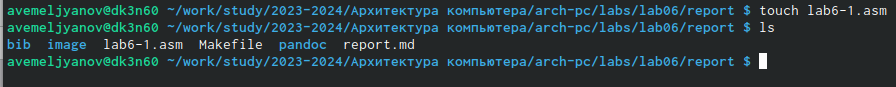{#fig:001 width=80%} 

открыл файл и внёс необходимые данные (рис. @fig:002), 

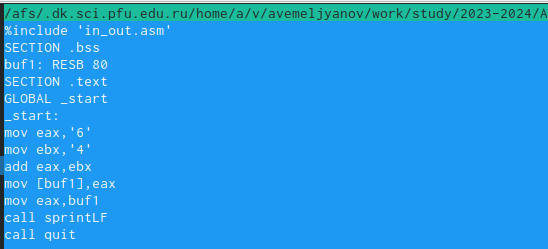{#fig:002 width=80%}

создаю объектный файл, компаную его и проверяю работоспособность, всё работает? (рис. @fig:003), 

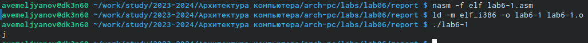{#fig:003 width=70%}

пытаюсь заново обработать второй вариант этого файла, снова неправильно, но так и должно быть. Ответ = символ новой строки (рис. @fig:004), 

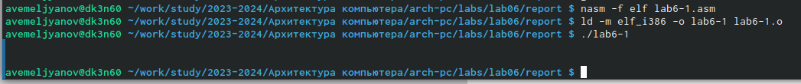{#fig:004 width=70%}

сделал исправления в файле связанные с изменением формата данных (рис. @fig:005), 

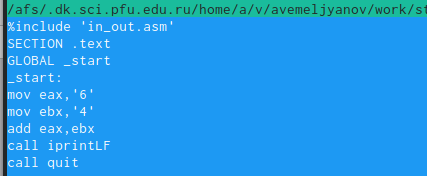{#fig:005 width=70%}

помогло, но не очень, снова ошибка в вычислении (рис. @fig:006), 

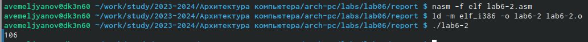{#fig:006 width=70%}

новая замена, ПОМОГЛО (рис. @fig:007), 

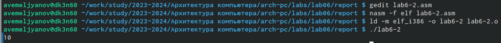{#fig:007 width=70%}

изменил printLF на print - строка слиплась (рис. @fig:008), 

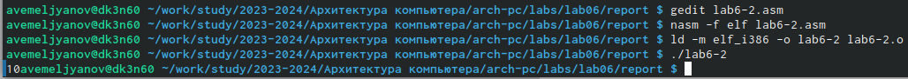{#fig:008 width=70%}

Переходим к вычислению арифметических операций в  NASM, переписал програму для подсчта результата арифметической операции (рис. @fig:009).

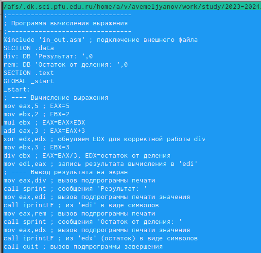{#fig:009 width=70%}

Кстати, вот результат её работы (рис. @fig:0010).

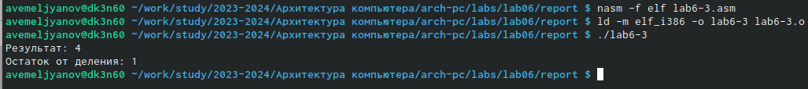{#fig:0010 width=70%}

затем изменил несколько строк в програме, чтобы она считала мне другое выражение (рис. @fig:0011), 

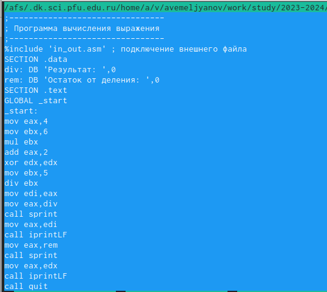{#fig:0011 width=70%}

Как видите результат изменился (рис. @fig:0012), 

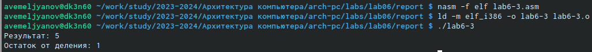{#fig:0012 width=70%}

после этого я ввёл програму подсчёта варианта по номеру студенческого билета (на самом деле рандомное число вобью) (рис. @fig:0013), 

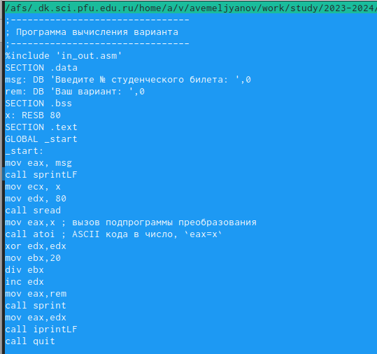{#fig:0013 width=70%}

затем я вбил 2 значения: первое тестовое, а второе - это конечные числа моего студака, вроде, ладно, нет, просто такие числа захотелось вбить, всё равно видно, что это я делал, мой же ж аккаунт (рис. @fig:0014). 

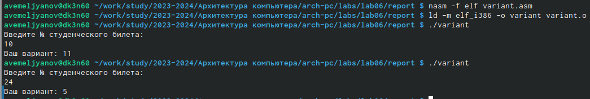{#fig:0014 width=70%}

РЕКЛАМНАЯ ПАУЗА (ответы на обязательные вопросы к прошлой програме):
   1. Какие строки листинга 6.4 отвечают за вывод на экран сообщения ‘Ваш вариант:’?

	mov, eax, и rem - заносит в регистр посчитаное значение, добавляя фразу 'Ваш вариант'. Также используется подпрограма из внешнего файла 'call sprint' - она выводит строку.
	
   2. Для чего используется следующие инструкции?

   mov ecx, x
   mov edx, 80
   call sread
	Это группа команд позволяет нам считать с консоли значение номера студ билета
	
   3. Для чего используется инструкция “call atoi”?

	Эта подпрограма переводит введённые данные в числовой формат, в данном случае мы буквально указываем, что номер студ билета - это число.
   4. Какие строки листинга 6.4 отвечают за вычисления варианта?

	xor edx, edx
	mov ebx, 20
	div ebx
	
   5. В какой регистр записывается остаток от деления при выполнении инструкции “div ebx”?

	1 байт = AH
	2 байта = DX
	4 байта = EDX
	мы работали с третьим вариантом
   6. Для чего используется инструкция “inc edx”?

	просто увеличить на единицу edx, от нас это требовалось в условии задачи
	
   7. Какие строки листинга 6.4 отвечают за вывод на экран результата вычислений?

	mov eax, edx = результаты счёта (edx) переносим в eax.
	call isprintLF = вызов подпрограмы вывода

Мой вариант - пятый, вот его выражение (рис. @fig:0015), 

{#fig:0015 width=70%}

а вот текст моей програмы (рис. @fig:0016), 

{#fig:0016 width=70%}

вот результат её работы, кстати, это правельный результат (рис. @fig:0017), 

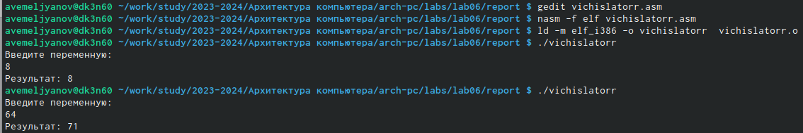{#fig:0017 width=70%}

и наконец я загрузил отчёт на github, святые Катод и Анод, пусть всё будет на месте.

# Выводы

В ходе выполнения данной лабораторной работы мои навыки работы с операционной системой Linux и различными её системами (компонентами) несомненно улучшились по сравнению с моими навыками  до работы, также у меня открылось всевидящее око созерцания в середине лба: я стал остро чувствовать перемены окружающего мира не только в его физической составляющей, но и духовной - день ото дня я становлюсь всё ближе к своей просветлённой форме брахмана. А ещё я внёс свою скромную лепту в развитие компьютерных технологий, написав эту, несомненно уникальную и абсолютно недооценённую работу. Кроме того прошу Вас (дорогой читатель) обратить внимание на изящный и не обременяющий слог моего большого и богатого вывода, я определённо достоин премии по литературе за эту работу. Ах да, NASM, LD и Midnight Commander - теперь мои друзья. Научился основам работы в MC, а также некоторым основам межфайлового взаимодействия.

# Список литературы{.unnumbered}

:::
::: 

