---
## Front matter
title: "Шаблон отчёта по лабораторной работе №8"
subtitle: "Вариант, ЧТТМ/6 баллов, дальше  не проверять."
author: "Емельянов Антон (НПМбв-01-21)"

## Generic otions
lang: ru-RU
toc-title: "Содержание"

## Bibliography
bibliography: bib/cite.bib
csl: pandoc/csl/gost-r-7-0-5-2008-numeric.csl

## Pdf output format
toc: true # Table of contents
toc-depth: 2
lof: true # List of figures
lot: true # List of tables
fontsize: 12pt
linestretch: 1.5
papersize: a4
documentclass: scrreprt
## I18n polyglossia
polyglossia-lang:
  name: russian
  options:
	- spelling=modern
	- babelshorthands=true
polyglossia-otherlangs:
  name: english
## I18n babel
babel-lang: russian
babel-otherlangs: english
## Fonts
mainfont: PT Serif
romanfont: PT Serif
sansfont: PT Sans
monofont: PT Mono
mainfontoptions: Ligatures=TeX
romanfontoptions: Ligatures=TeX
sansfontoptions: Ligatures=TeX,Scale=MatchLowercase
monofontoptions: Scale=MatchLowercase,Scale=0.9
## Biblatex
biblatex: true
biblio-style: "gost-numeric"
biblatexoptions:
  - parentracker=true
  - backend=biber
  - hyperref=auto
  - language=auto
  - autolang=other*
  - citestyle=gost-numeric
## Pandoc-crossref LaTeX customization
figureTitle: "Рис."
tableTitle: "Таблица"
listingTitle: "Листинг"
lofTitle: "Список иллюстраций"
lotTitle: "Список таблиц"
lolTitle: "Листинги"
## Misc options
indent: true
header-includes:
  - \usepackage{indentfirst}
  - \usepackage{float} # keep figures where there are in the text
  - \floatplacement{figure}{H} # keep figures where there are in the text
---

# Цель работы

Приобретение навыков написания программ с использованием циклов и обработкой аргументов командной строки. Дополнительной, но от этого не менее важной частью работы является повышение общей компьютерной грамотности пользователя, повышение скорости печати, уверенности в себе.

# Задание

Переписывать задания не имеет смысла, так как это не приносит, предлагаю тренировать память - это для мозга, и как следствие возможно продлит сознательную возможно ментально здоровую жизнь в старости. А ещё можно эффективно тренировать (это если на этом моменте Вы чувствуете невыносимое желание закрыть работу и поставить 0 - этого делать НЕ надо, надо ставить 6).

# Теоретическое введение

Опасно, сам могилу могу вырыть, ведь моя работа вроде бы данной лабораторной работы (методом пошагового обьяснения обрезанными, шакальными и не обязательно расставленными по порядку сериями случайных картинок), никому не залезть в руководство ради такого сущего пустяка как подтверждение (проверка) информации, расширения области знания (зачем? И так всё уже мог кто-то объяснить) или ещё какой чепухи (уважаемый автор данной работы, то есть Я, настоятельно не рекомендует делать лишних телодвижений: любите диван и он вас полюбит в ответ). На этом всё, будте здоровы.

# Выполнение лабораторной работы

Итак, приступим к описанию моих героических подвигов и гениальных изысканий совершённых в ходе выполнения этой работы:

Я всё выполнял строго по инструкции: лихо создал необходимый файл в нужном месте, обратил в объектный и запустил програму обратного отсчёта (рис. @fig:001),

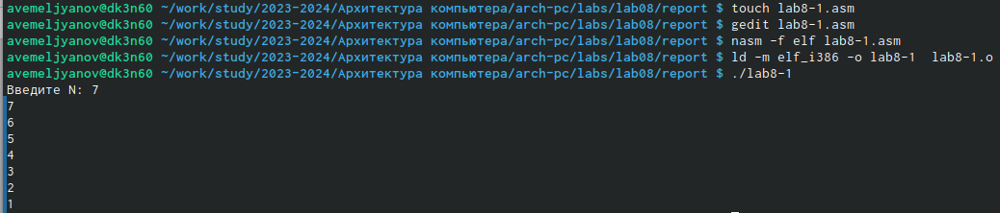{#fig:001 width=80%} 

Внёс изменения - устранил уязвимость програмы переназначив счётчик. На результат это не повлияло, вот код Счётчика без уязвимости (рис. @fig:002), 

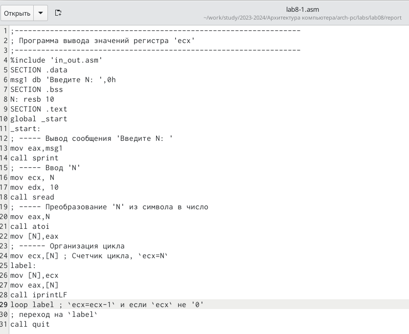{#fig:002 width=80%}

Вот результат работы этого счётчика - всё тоже самое (рис. @fig:003), 

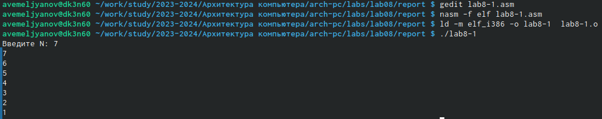{#fig:003 width=70%}

После этого сменил счётчик, теперь он считает от N-1 до 0, вот его код (рис. @fig:004), 

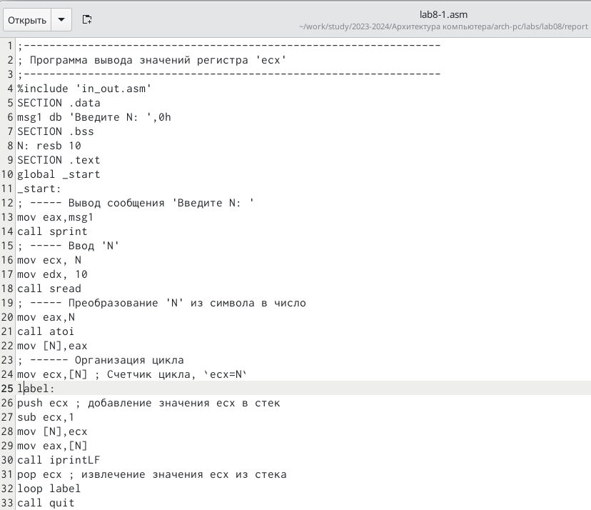{#fig:004 width=70%}

Результат работы счётчика (рис. @fig:005), 

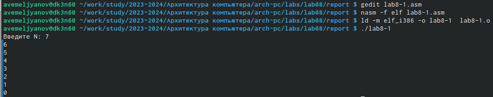{#fig:005 width=70%}

Програма №2 считывает 3 аргумента и помещает их в стек по одному, а затем вытаскивает с конца, т.е. первый вошёл и первый вышел, вот её код (рис. @fig:006), 

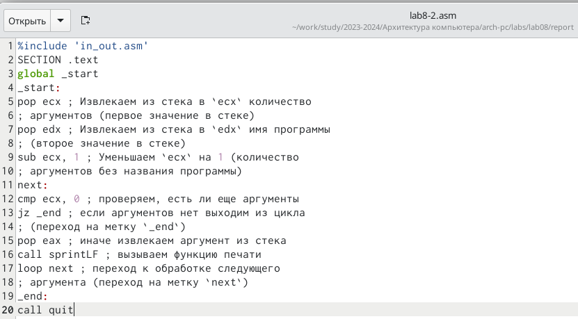{#fig:006 width=70%}

Результат работы стекавателя - первый первым и остался (рис. @fig:007), 

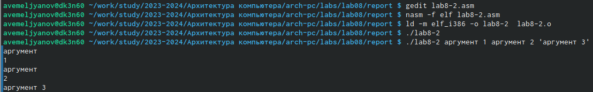{#fig:007 width=70%}

Програма 3 вариант 1 = сумматор, собирает значения в стек и суммирует. (рис. @fig:008), 

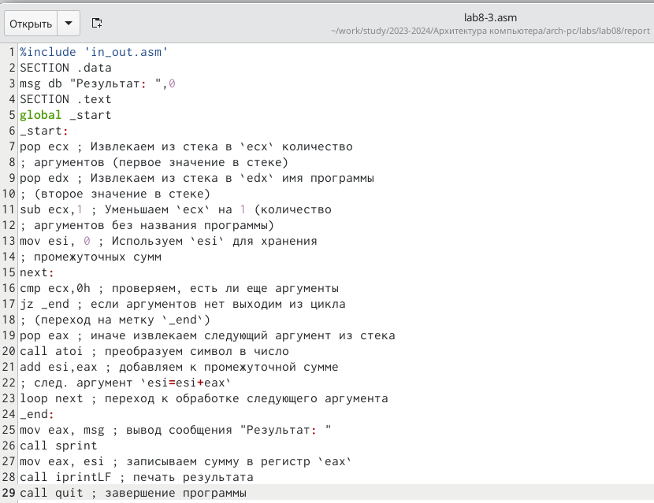{#fig:008 width=70%}

результат работы этой програмы (рис. @fig:009).

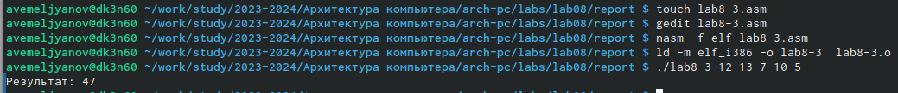{#fig:009 width=70%}

Програма 3 вариант 2 = умножатор, слбирает значения в стек и перемножает их. Вот код програмы (рис. @fig:0010).

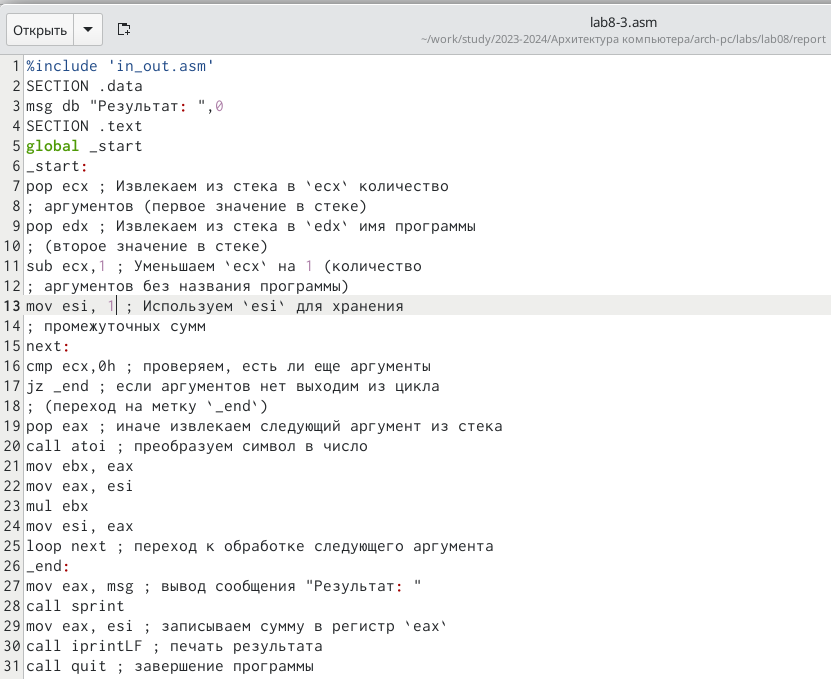{#fig:0010 width=70%}

А вот результат её работы (рис. @fig:0011), 

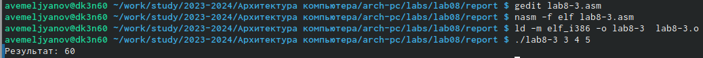{#fig:0011 width=70%}

Самостоятельная работа вариант 5, нужно обработать выражение и научить компуктер преобразовывать согласно формуле вводимые через консоль данные, а затем загонять их в стек и суммировать, вот её код (рис. @fig:0012), 

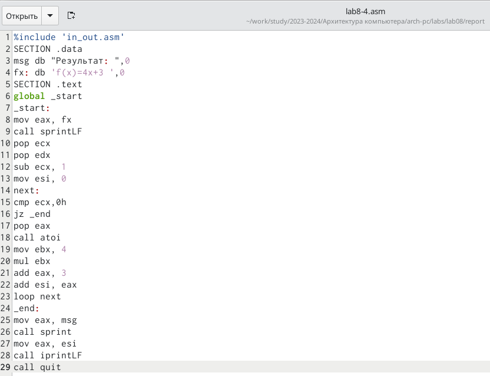{#fig:0012 width=70%}

Результат работы програмы для одного и для двух чисел ( можно и больше, но мне ж надо проверять это, поэтому двух хватит), всё правильно, всё работает (рис. @fig:0013), 

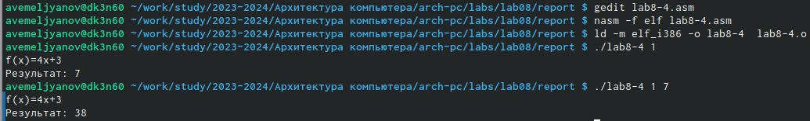{#fig:0013 width=70%}

и наконец я загрузил отчёт на github, святые Катод и Анод, молю ВАС!!! Пусть всё будет на месте.

# Выводы

В ходе выполнения данной лабораторной работы мои навыки работы с операционной системой Linux и различными её системами (компонентами) несомненно улучшились по сравнению с моими навыками  до работы, также у меня открылось всевидящее око созерцания в середине лба: я стал остро чувствовать перемены окружающего мира не только в его физической составляющей, но и духовной - день ото дня я становлюсь всё ближе к своей просветлённой форме брахмана. А ещё я внёс свою скромную лепту в развитие компьютерных технологий, написав эту, несомненно уникальную и абсолютно недооценённую работу. Кроме того прошу Вас (дорогой читатель) обратить внимание на изящный и не обременяющий слог моего большого и богатого вывода, я определённо достоин премии по литературе за эту работу. Ах да, теперь я дружу со списочками, стеками и в целом устал.

# Список литературы{.unnumbered}

:::
::: 

