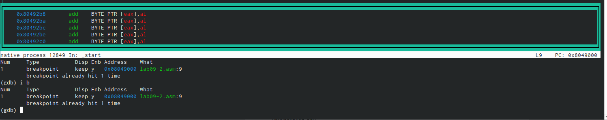

---
## Front matter
title: "Шаблон отчёта по лабораторной работе №9"
subtitle: "Нечто, X/6 баллов, дальше."
author: "Емельянов Антон (НПМбв-01-21)"

## Generic otions
lang: ru-RU
toc-title: "Содержание"

## Bibliography
bibliography: bib/cite.bib
csl: pandoc/csl/gost-r-7-0-5-2008-numeric.csl

## Pdf output format
toc: true # Table of contents
toc-depth: 2
lof: true # List of figures
lot: true # List of tables
fontsize: 12pt
linestretch: 1.5
papersize: a4
documentclass: scrreprt
## I18n polyglossia
polyglossia-lang:
  name: russian
  options:
	- spelling=modern
	- babelshorthands=true
polyglossia-otherlangs:
  name: english
## I18n babel
babel-lang: russian
babel-otherlangs: english
## Fonts
mainfont: PT Serif
romanfont: PT Serif
sansfont: PT Sans
monofont: PT Mono
mainfontoptions: Ligatures=TeX
romanfontoptions: Ligatures=TeX
sansfontoptions: Ligatures=TeX,Scale=MatchLowercase
monofontoptions: Scale=MatchLowercase,Scale=0.9
## Biblatex
biblatex: true
biblio-style: "gost-numeric"
biblatexoptions:
  - parentracker=true
  - backend=biber
  - hyperref=auto
  - language=auto
  - autolang=other*
  - citestyle=gost-numeric
## Pandoc-crossref LaTeX customization
figureTitle: "Рис."
tableTitle: "Таблица"
listingTitle: "Листинг"
lofTitle: "Список иллюстраций"
lotTitle: "Список таблиц"
lolTitle: "Листинги"
## Misc options
indent: true
header-includes:
  - \usepackage{indentfirst}
  - \usepackage{float} # keep figures where there are in the text
  - \floatplacement{figure}{H} # keep figures where there are in the text
---

# Цель работы

Приобретение навыков написания программ с использованием подпрограмм. Знакомство с методами отладки при помощи GDB и его основными возможностями. Дополнительной, но от этого не менее важной частью работы является повышение общей компьютерной грамотности пользователя, повышение скорости печати, уверенности в себе.

# Задание

Переписывать не имеет смысла, не приносит каких-то знаний и умений, тренировать память - это бесполезно для мозга, и как следствие возможно укоротит мою возможно сознательную возможно жизнь в старости. А ещё придётся тренировать терпимость (это если на этом моменте Вы чувствуете невыносимое желание закрыть работу и поставить 0 - этого делать НЕ надо, надо ставить 9).

# Теоретическое введение

Опасно, могилу могу вырыть, ведь моя объясняет теорию данной работы (методом пошагового шакальными и обязательно расставленными по порядку сериями случайных), никому нельзя залезть в руководство ради такого сущего пустяка как подтверждение (проверка) информации, расширения области (Кто-то объяснить) или ещё какой чепухи (уважаемый автор данной работы, то есть Я, настоятельно не рекомендует делать лишних телодвижений: любите диван и он вас полюбит в ответ). На этом всё, будте здоровы, а я устал, больше с пракамя тянуть не буду. НИКОШДА.

# Выполнение лабораторной работы

Итак, приступим к описанию моих героических подвигов и гениальных изысканий совершённых в ходе выполнения этой работы:

Я всё выполнял строго по инструкции: лихо создал необходимый файл в нужном месте. Запустил его, всё считает правильно (рис. @fig:001),

{#fig:001 width=80%} 

Усовершенствовал прогу добавив туда подфункцию функции, короче F(G(x)), код програмы (рис. @fig:002), 

{#fig:002 width=80%}

Вот результат работы програмы, всё правильно, подфункция пашет (рис. @fig:003), 

{#fig:003 width=70%}

Запустил отладчик, ничего не понятно, но очень интересно (рис. @fig:004), 

{#fig:004 width=70%}

Заставил програму выполница командой run, привет миру (рис. @fig:005), 

{#fig:005 width=70%}

Залез в самую муть, пока всё кажется цветастым и непонятным (рис. @fig:006), 

{#fig:006 width=70%}

колдую с тригерами, точнее регистрами (рис. @fig:007), 

{#fig:007 width=70%}

пользуюсь краткими командами, уверенно (рис. @fig:008), 

{#fig:008 width=70%}

Заставил прогу сделать шаг командой si (рис. @fig:009).

{#fig:009 width=70%}

после применения команды info registers получил доступ к переменным (рис. @fig:0010).

{#fig:0010 width=70%}

Смотрю значение переменной по имени msg1 (рис. @fig:0011), 

{#fig:0011 width=70%}

Изменение первого символа переменной msg1 (рис. @fig:0012), 

{#fig:0012 width=70%}

Далее я также решил изменить значение переменной 0ч804a008 и попросил вывести значение переменной msg2 (рис. @fig:0013), 

{#fig:0013 width=70%}

Просмотр значения переменной (рис. @fig:0014). 

{#fig:0014 width=70%}

РЕКЛАМНАЯ ПАУЗА (ответы на обязательные вопросы к прошлой програме):
   1. Какие строки листинга 6.4 отвечают за вывод на экран сообщения ‘Ваш вариант:’?

Из 8 лабораторной работы в отладчик загрузил програму, сейчас начнётся магия... (рис. @fig:0015), 

{#fig:0015 width=70%}

Установка точки остановки, запуск и просмотр адреса вершины стека (рис. @fig:0016), 

{#fig:0016 width=70%}

Просмотр значений регистра, кстати шаг изменения равен 4, потому что размер переменной 4 байта (рис. @fig:0017), 

{#fig:0017 width=70%}

Самостоятельная работа! Из 8 лабораторной взял 1 програму из самостоятельной работы (вариант5) и реализовал вычисление значение функции как подпрограму, вот сам код (рис. @fig:0018), 

{#fig:0018 width=70%}

А вот результат работы програмы, всё правильно (рис. @fig:0019), 

{#fig:0019 width=70%}

Второе самостоятельное задание, здесь надо было через отладчик найти ошибку. мне выдало это, глазами видно, что у функции add неправильный порядок аргументов (рис. @fig:0020), 

{#fig:0020 width=70%}

Загрузил отчёт на github, святые Катод и Анод, пусть всё будет на месте, пожалуйста.

# Выводы

В ходе выполнения данной лабораторной работы мои навыки работы с операционной системой Linux и различными её системами (компонентами) несомненно улучшились по сравнению с моими навыками  до работы, также у меня открылось всевидящее око созерцания в середине лба: я стал остро чувствовать перемены окружающего мира не только в его физической составляющей, но и духовной - день ото дня я становлюсь всё ближе к своей просветлённой форме брахмана. А ещё я внёс свою скромную лепту в развитие компьютерных технологий, написав эту, несомненно уникальную и абсолютно недооценённую работу. Кроме того прошу Вас (дорогой читатель) обратить внимание на изящный и не обременяющий слог моего большого и богатого вывода, я определённо достоин премии по литературе за эту работу. Ах да, Боль, страдание, мучение, подпрограмы, подпрограмы подпрограм, надо делать...

# Список литературы{.unnumbered}

:::
::: 

