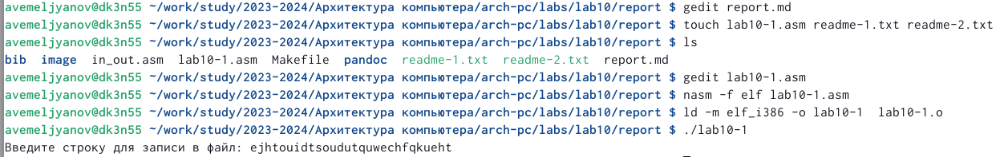
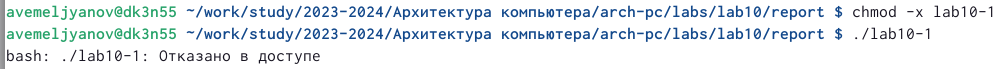
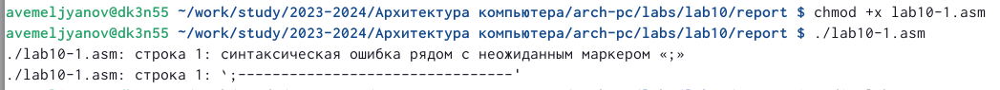
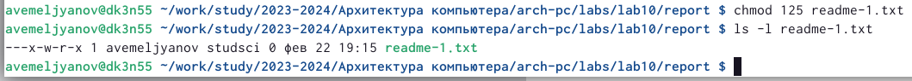
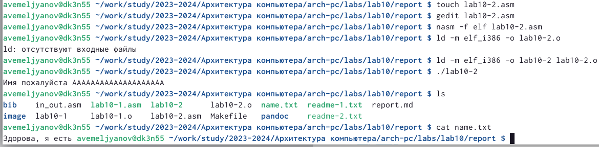
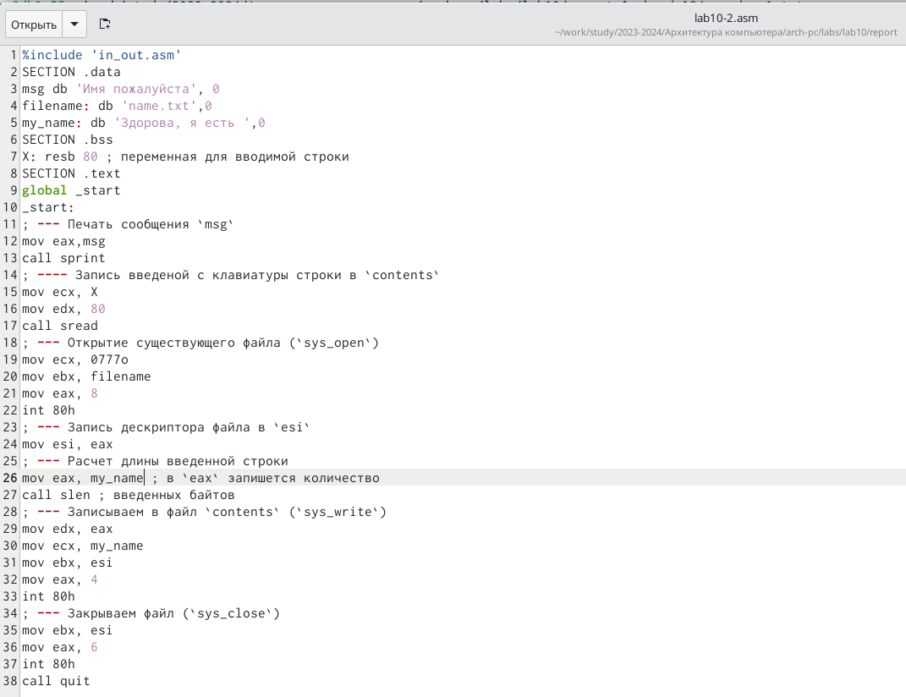

---
## Front matter
title: "Шаблон отчёта по лабораторной работе №10"
subtitle: "Нечто, X-2/6 баллов, дальше."
author: "Емельянов Антон (НПМбв-01-21)"

## Generic otions
lang: ru-RU
toc-title: "Содержание"

## Bibliography
bibliography: bib/cite.bib
csl: pandoc/csl/gost-r-7-0-5-2008-numeric.csl

## Pdf output format
toc: true # Table of contents
toc-depth: 2
lof: true # List of figures
lot: true # List of tables
fontsize: 12pt
linestretch: 1.5
papersize: a4
documentclass: scrreprt
## I18n polyglossia
polyglossia-lang:
  name: russian
  options:
	- spelling=modern
	- babelshorthands=true
polyglossia-otherlangs:
  name: english
## I18n babel
babel-lang: russian
babel-otherlangs: english
## Fonts
mainfont: PT Serif
romanfont: PT Serif
sansfont: PT Sans
monofont: PT Mono
mainfontoptions: Ligatures=TeX
romanfontoptions: Ligatures=TeX
sansfontoptions: Ligatures=TeX,Scale=MatchLowercase
monofontoptions: Scale=MatchLowercase,Scale=0.9
## Biblatex
biblatex: true
biblio-style: "gost-numeric"
biblatexoptions:
  - parentracker=true
  - backend=biber
  - hyperref=auto
  - language=auto
  - autolang=other*
  - citestyle=gost-numeric
## Pandoc-crossref LaTeX customization
figureTitle: "Рис."
tableTitle: "Таблица"
listingTitle: "Листинг"
lofTitle: "Список иллюстраций"
lotTitle: "Список таблиц"
lolTitle: "Листинги"
## Misc options
indent: true
header-includes:
  - \usepackage{indentfirst}
  - \usepackage{float} # keep figures where there are in the text
  - \floatplacement{figure}{H} # keep figures where there are in the text
---

# Цель работы

Приобретение навыков написания программ для работы с файлами. Знакомство с методами отладки при помощи GDB и его основными возможностями. Дополнительной, но от этого не менее важной частью работы является повышение общей компьютерной грамотности пользователя, повышение скорости печати, уверенности в себе.

# Задание

Смысла, не приносит каких-то знаний и умений, тренировать память - это бесполезно для мозга, и как следствие укоротит мою жизнь в старости. Терпимость (это если на этом моменте Вы чувствуете невыносимое желание закрыть работу и поставить 0 - этого делать НЕ надо, надо ставить +3).

# Теоретическое введение

Опасно, ведь моя объясняет теорию данной работы (методом пошагового шакальными и обязательно расставленными по порядку сериями случайных), никому нельзя залезть в руководство ради такого сущего пустяка как подтверждение (проверка) информации, расширения области (Кто-то объяснить) или ещё какой чепухи (уважаемый автор данной работы, то есть Я, настоятельно не рекомендует делать лишних телодвижений: любите диван и он вас полюбит в ответ). На этом всё, будте здоровы, а я устал, больше с пракамя тянуть не буду. НИКОШДА.

# Выполнение лабораторной работы

Итак, приступим к описанию моих героических подвигов и гениальных изысканий совершённых в ходе выполнения этой работы:

Создал файлов кучку, и заполгил програму, считывающую мою строку (рис. @fig:001),

{#fig:001 width=80%} 

Запрещаю доступ на чтение, а затем проверяю качество своей работы. как итог имеем нечитаемый файл (рис. @fig:002), 

{#fig:002 width=80%}

Разрешаю чтение, смотрю на результат (рис. @fig:003), 

{#fig:003 width=70%}

Здесь я в восьмиричном формате командой chmod задаю условия доступа как в 5 варианте, почему-то обычный код не работал, пришлось искать методом тыка (рис. @fig:004), 

{#fig:004 width=70%}

Самостоятельная работа! Надо сделать прогу способную записать в текстовик что-то из ввода. Файл открыл для записи, но не помогло. Вот результат (рис. @fig:005), 

{#fig:005 width=70%}

А вот текст самой проги, она не записывает в файл и это грустно (рис. @fig:006), 

{#fig:006 width=70%}

Загрузил отчёт на github, святые Катод и Анод, пусть всё будет на месте, пожалуйста, молюююювааааас.

# Выводы

В ходе выполнения данной лабораторной работы мои навыки работы с операционной системой Linux и различными её системами (компонентами) несомненно улучшились по сравнению с моими навыками  до работы, также у меня открылось всевидящее око созерцания в середине лба: я стал остро чувствовать перемены окружающего мира не только в его физической составляющей, но и духовной - день ото дня я становлюсь всё ближе к своей просветлённой форме брахмана. А ещё я внёс свою скромную лепту в развитие компьютерных технологий, написав эту, несомненно уникальную и абсолютно недооценённую работу. Кроме того прошу Вас (дорогой читатель) обратить внимание на изящный и не обременяющий слог моего большого и богатого вывода, я определённо достоин премии по литературе за эту работу. Ах да, Боль, страдание, мучение, подпрограмы, подпрограмы подпрограм, надо делать... Я устал, Босс, отпустите меня с баллами.

# Список литературы{.unnumbered}

:::
::: 

